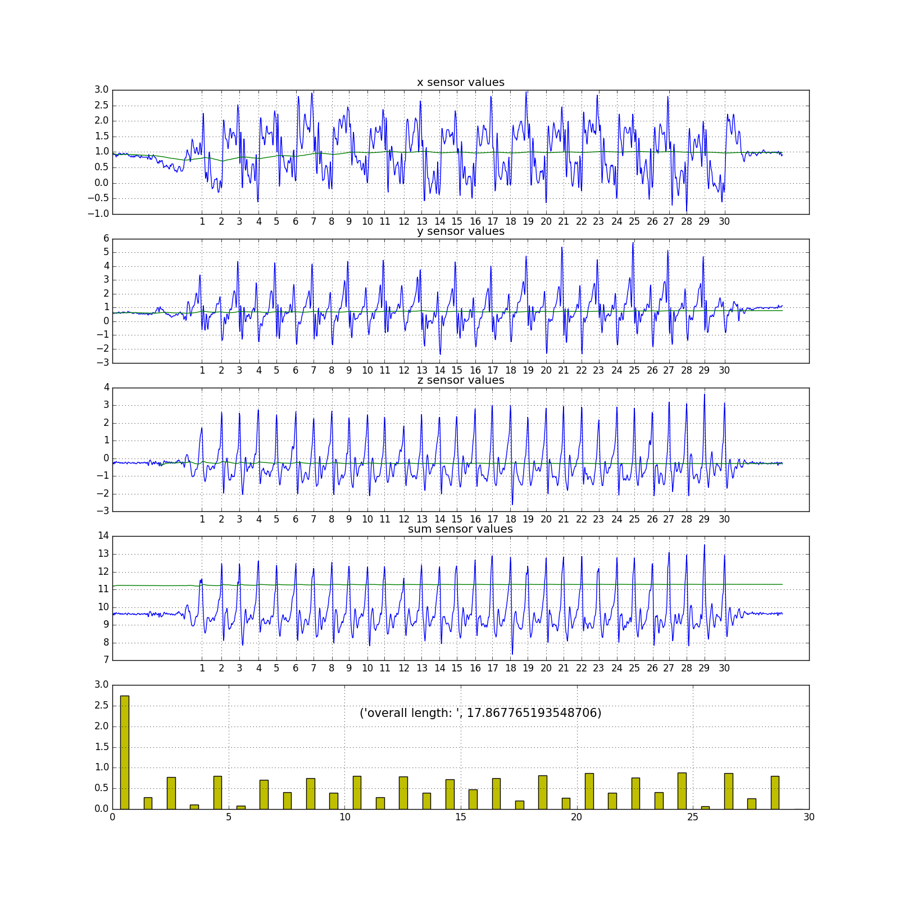
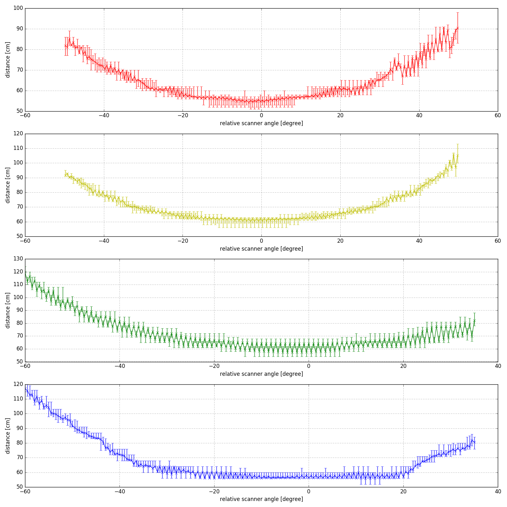
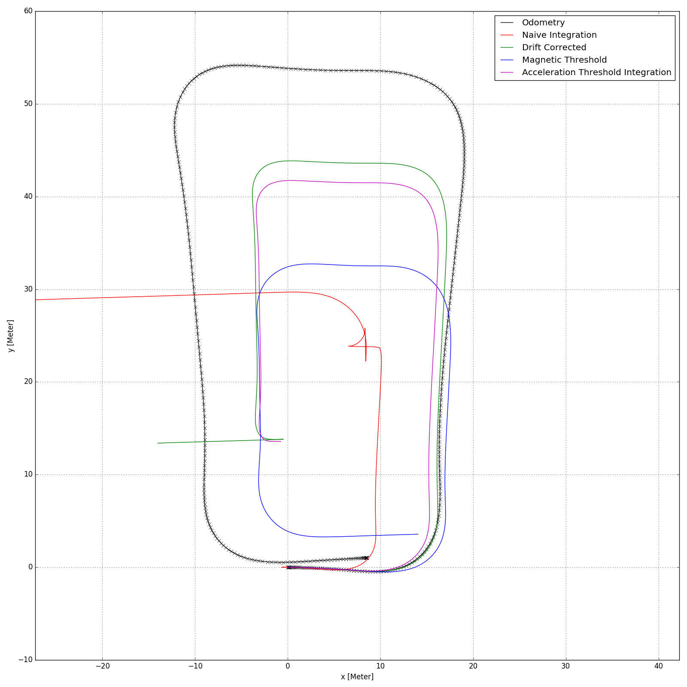

# python-plots
This project gathers different plotting routines for .csv-like data sources. It makes use of [numpy](http://www.numpy.org/), [matplotlib](http://matplotlib.org/) and [pylab](https://www.scipy.org/index.html).

## Getting Started

Adapt the python files to your purposes or even use the existing code to plot your data.

## Example plots
### plotting IMU data
Simple pedestrian step counting implementation to analyse IMU data from Android phone.

### plotting LiDAR data
Visualize error characteristics from an Ibeo Lux4 LiDAR sensor.

### plotting odometry data
Visualize the error growth when integrating IMU data versus odometry from wheel encoders.

